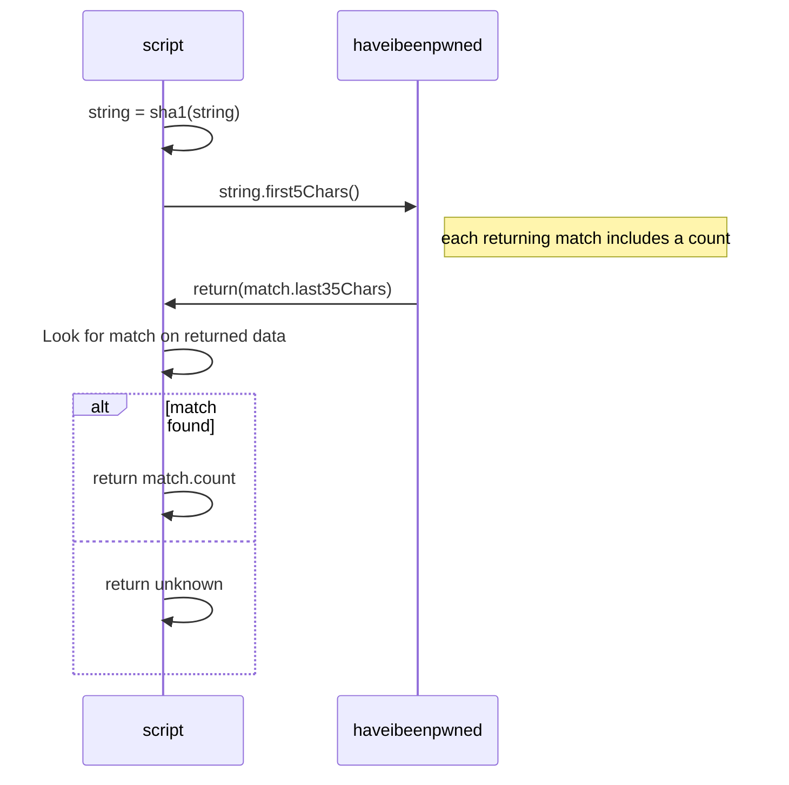

# passpwned

Shell script leveraging haveibeenpwned.com's API https://haveibeenpwned.com/API/v2#PwnedPasswords to identify whether strings appear in known password lists

## Usage
```
$ ./passpwned.sh <string>
```

## Example
In the following example, a check against the string `aweakpassword` returns one hit

    $ ./passpwned.sh aweakpassword
    Password appears 1 times

## Script Flow
Implementation of [k-Anonymity model](https://en.wikipedia.org/wiki/K-anonymity)


